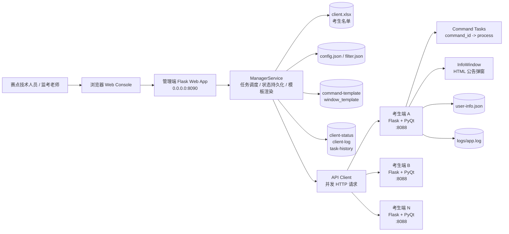

# Contest Manager

> 面向线下编程竞赛、机房考试与集中化上机环境的轻量级考场管理工具。

Contest Manager 采用管理端 + 考生端的 C/S 架构。管理端运行在教师机或赛点管理机上，考生端运行在每台 Windows 考生机上；管理端通过局域网 HTTP API 批量完成连通性检查、名单绑定、考生信息下发、命令执行、公告弹窗、日志采集与状态巡检。

本项目已在实际赛点环境中使用。当前版本以 Web 管理面板为主线能力，并加入异步并行 command 执行、基于客户端 Command ID 的命令生命周期管理，降低赛前准备和赛中应急操作成本。

## 功能特性

- Web 管理面板：提供配置编辑、名单上传、考生选择、批量操作、任务进度、模板调用和运行日志查看。
- 考生名单管理：支持从 Excel 读取考生信息，并按考场、机位、IP、组别、考试编号等字段统一管理。
- 局域网连通检查：支持 IP 段 Ping 扫描和客户端 HTTP Connect Check，区分机器在线与客户端服务在线。
- 批量信息下发：将考生个人信息写入对应考生端，便于弹窗、日志和命令模板按人渲染。
- 批量公告弹窗：考生端使用 PyQt 展示置顶信息窗口，内容支持 HTML/CSS/JS 和模板变量。
- 批量命令执行：管理端可向选中或全部考生机下发系统命令，支持模板化命令内容。
- 命令生命周期控制：每条命令带 `command_id`，客户端按 ID 跟踪运行状态，并可精准停止指定命令。
- 并行任务调度：管理端对多台客户端并发请求，Web 端可查看任务进度和结果摘要。
- 日志与状态采集：可批量拉取客户端状态、活动命令、最近日志，并保存到管理端目录。
- 正则过滤：支持按 IP、姓名、准考证号、组别进行精准筛选，适合分组、补测、换机等场景。
- Windows 自启动脚本：提供客户端启动、守护、停止和计划任务安装脚本。

## 创新点

- 从命令行工具升级为可视化 Web Console：赛点技术人员无需记忆大量 CLI 参数，可在浏览器里完成大多数操作。
- 修复并强化 `run-command` 并行执行模型：命令下发不再被单台机器阻塞，管理端按考生列表并发执行，提升大机房操作效率。
- 引入 Windows 客户端 `command_id` 策略：同一考生机可区分 `env-check`、`open-chrome`、`ping-server` 等命令，避免不同命令互相覆盖或误杀。
- 客户端命令异步执行：考生端收到命令后立即返回启动结果，后台监控 stdout、stderr、return code 和运行状态。
- 精准 Kill Command：管理端按 `command_id` 下发停止请求，Windows 下使用 `taskkill /PID /F /T` 结束进程树。
- 面向真实考场流程设计：内置考生信息弹窗、考试提醒模板、环境检查、浏览器打开、断网验证等可复用模板。
- API Key 按客户端 IP 与日期动态生成：在局域网场景下提供轻量认证，避免未经授权的简单请求直接操作客户端。

## 架构图



## 项目结构

```text
contest-manage/
├── readme.md
├── LICENSE
├── requirements.txt
├── doc/
├── scripts/
│   └── windows-client/
│       ├── start_client.bat
│       ├── stop_client.bat
│       ├── watch_client.bat
│       └── install_autorun.bat
└── src/
    ├── client/
    │   ├── app.py
    │   ├── info_window.py
    │   └── utility.py
    ├── manager/
    │   ├── web_app.py
    │   ├── manager_service.py
    │   ├── main.py
    │   ├── config.json
    │   ├── filter.json
    │   ├── command-template/
    │   ├── window_template/
    │   └── web/
    └── tools/
```

## 运行环境

- Python 3.10+。
- 管理端支持 Windows、Linux、macOS；实际考场建议运行在 Windows 教师机。
- 考生端面向 Windows 机房环境，弹窗依赖 PyQt5 / PyQtWebEngine。
- 管理端与考生端必须处于同一局域网，且考生机 `8088` 端口可访问。
- Web 管理面板默认监听 `8090` 端口。

## 配置说明

管理端配置文件位于 `src/manager/config.json`。

```json
{
  "ROOM_ID": "101",
  "IP_RANGE": "192.168.1.1-150",
  "LOCAL_IP": "192.168.1.10",
  "CLIENT_EXCEL_PATH": "./client.xlsx",
  "CLIENT_EXCEL_TITLE": {
    "user_id": "准考证号",
    "user_name": "学生姓名",
    "user_room": "考生考场",
    "user_no": "考生机位号",
    "user_ip": "考生机器IP",
    "group_id": "参赛科目",
    "exam_id": "考试编号"
  }
}
```

字段含义：

- `ROOM_ID`：当前考场或机房编号。
- `IP_RANGE`：待扫描客户端 IP 段，格式为 `192.168.1.1-150`。
- `LOCAL_IP`：教师机或赛点服务器 IP，可用于模板中生成访问地址。
- `CLIENT_EXCEL_PATH`：考生名单路径，相对路径以 `src/manager` 为基准。
- `CLIENT_EXCEL_TITLE`：程序内部字段到 Excel 表头的映射。

正则过滤文件位于 `src/manager/filter.json`。启用后，批量操作只作用于匹配的客户端。

```json
{
  "active": true,
  "ip": {"reg": "^192\\.168\\.1\\."},
  "user_name": {"reg": ""},
  "user_id": {"reg": ""},
  "group_id": {"reg": "C/C\\+\\+"}
}
```

## Quick Start

### 1. 克隆项目

```bash
git clone git@github.com:Gerchart-GXT/contest-manage.git
cd contest-manage
```

如果没有配置 SSH，也可以使用 HTTPS：

```bash
git clone https://github.com/Gerchart-GXT/contest-manage.git
cd contest-manage
```

### 2. 安装 Python 依赖

下方命令中的 `python` 可按本机环境替换为 `py` 或 `python3`。

Windows PowerShell：

```powershell
python -m venv env
.\env\Scripts\Activate.ps1
pip install -r requirements.txt
```

Windows CMD：

```bat
python -m venv env
env\Scripts\activate.bat
pip install -r requirements.txt
```

Linux / macOS：

```bash
python -m venv env
source env/bin/activate
pip install -r requirements.txt
```

### 3. 准备管理端配置

进入管理端目录：

```bash
cd src/manager
```

准备 `client.xlsx`，并确认 `config.json` 中的 `CLIENT_EXCEL_TITLE` 与 Excel 表头一致。建议至少包含准考证号、姓名、考场、机位、IP、组别等字段。

### 4. 启动 Web 管理面板

```bash
python web_app.py
```

在浏览器打开：

```text
http://127.0.0.1:8090
```

在面板中可以完成配置保存、Excel 上传、名单刷新、Ping、Connect Check、考生信息下发、批量命令和公告弹窗。

### 5. 启动考生端

开发调试时，可直接在考生机运行：

```bash
cd src/client
python app.py
```

正式 Windows 考场部署时，建议将客户端打包为 `lanqiao_client.exe`，并放置到：

```text
C:\lanqiao\client
```

仓库中的 Windows 脚本负责启动、停止和守护该 exe，不包含打包产物本身。准备好 `C:\lanqiao\client\lanqiao_client.exe` 后，可通过教师端远程命令执行：

```bat
C:\lanqiao\client\start_client.bat
```

如需安装开机或登录后自动守护，可在管理员权限下执行：

```bat
C:\lanqiao\client\install_autorun.bat
```

### 6. 验证链路

在 Web 面板中依次执行：

1. `Ping`：确认 IP 段内机器在线情况。
2. `Connect Check`：确认考生端 `8088` 服务已启动。
3. `下发考生信息`：将名单中的考生信息写入对应客户端。
4. `获取状态`：确认客户端可返回用户信息、活动命令和时间戳。

### 7. 执行常用考场动作

使用 Web 面板的命令模板：

- `env-check`：检查 Python、Java、GCC、Node.js 版本。
- `open-chrome`：在考生机打开浏览器访问赛点服务器。
- `close-chrome`：关闭考生机 Chrome。
- `ping-server`：测试考生机到教师机或赛点服务器的网络。
- `ping-baidu`：用于断外网后验证外网解析或访问是否失败。

使用 Web 面板的窗口模板：

- `info`：显示考生信息、机位号和登录链接。
- `8-45`、`10`、`12-45`、`13`：考试节点公告。
- `password`：下发试题解压密码提示。

## CLI 兼容入口

当前版本推荐使用 Web 管理面板，Web 面板直接调用 `ManagerService`，是主要维护路径。仓库仍保留 `src/manager/main.py` 作为兼容入口，适合脚本化或无浏览器环境。

```bash
cd src/manager
python main.py ping
python main.py connect-check
python main.py set-client-info
python main.py get-client-status
python main.py get-client-log
python main.py run-command
python main.py kill-command
python main.py open-info-window 1
python main.py close-info-window 1
```

CLI 的 `run-command` 和 `kill-command` 读取 `src/manager/command.json`。Web 面板则可以直接选择 `command-template` 中的模板，并通过表单里的 `Command ID` 控制客户端命令实例。

## 命令模板

命令模板存放于 `src/manager/command-template/`，JSON 格式如下：

```json
{
  "command_id": "env-check",
  "command": "f'python --version && java -version && gcc --version && node -v'"
}
```

模板支持 Python f-string 风格，当前可用变量：

- `LOCAL_IP`：来自 `config.json`。
- `client`：当前考生数据字典，例如 `client["user_name"]`、`client["user_no"]`、`client["user_ip"]`。

命令 ID 建议稳定且语义化，例如 `env-check`、`open-chrome`、`exam-server-check`。Web 面板套用模板后仍可手动调整 `Command ID`；同一客户端上相同 `command_id` 同时只能运行一个实例，防止重复下发导致进程失控。

## 窗口模板

窗口模板存放于 `src/manager/window_template/`，JSON 格式如下：

```json
{
  "title": "考生信息",
  "content": "f'<h1>{client[\"user_name\"]}</h1><p>机位：{client[\"user_no\"]}</p>'",
  "front_size": 40
}
```

窗口内容支持 HTML/CSS/JS，可用于考生信息确认、考场纪律提醒、考试倒计时提示和密码公告。

## 安全说明

- 本项目设计目标是可信局域网内的考场辅助管理，不建议暴露到公网。
- 管理端会根据客户端 IP 与当天日期生成 API Key，客户端仅接受带有正确 `X-Api-Key` 的敏感请求。
- `run-command` 具备执行系统命令的能力，请只在可信管理机使用，并严格控制模板来源。
- 模板渲染使用 f-string 风格表达式，请不要加载不可信模板。
- 正式比赛前建议固定 `config.json`、`filter.json` 和 `client.xlsx`，避免误操作导致名单覆盖。

## 常见问题

### Ping 成功但 Connect Check 失败

机器在线，但客户端服务没有启动、被防火墙拦截，或考生机尚未进入正确系统。请检查 `C:\lanqiao\client\start_client.bat` 是否执行成功，确认 `8088` 端口可访问。

### Connect Check 成功但下发信息失败

通常是 Excel 字段映射不完整、客户端写入目录无权限，或 API Key 与 IP 不匹配。请检查 `config.json`、客户端本机 IP 和管理端日志。

### Run Command 返回成功但命令没有效果

返回成功表示客户端已启动该命令，不代表业务动作一定完成。请使用 `获取状态` 查看 `active_commands`，或使用 `获取日志` 检查 stdout、stderr 和 return code。

### Kill Command 找不到命令

请确认停止时使用的 `Command ID` 与运行时一致。例如用 `env-check` 启动，就必须用 `env-check` 停止。

## Roadmap

- 文件分发与回收。
- 代码备份到数据盘。
- 客户端活跃窗口与活跃进程巡检。
- 更细粒度的角色权限与操作审计。
- 一键打包管理端和客户端发行包。

## 贡献

欢迎提交 Issue 和 Pull Request。建议贡献前先说明使用场景、机房规模、操作系统版本和复现步骤，便于判断是否属于通用需求。

## License

本项目基于 MIT License 开源，详见 [LICENSE](LICENSE)。
